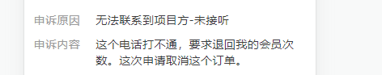

### 重要接口

接单订单详情-详情

```http
order/AppOrderDetailForGrabApiRequest
```


### 特殊实现

#### app-设置自定义导航栏

```html
<script>
export default {
    created() {
        // 设置自定义导航栏
        this.setNavBar()
    },
    methods: {
        setNavBar() {
            const sendObj = {
                reqType: 'GET_WEB_PAGE_TITLE',
                data: {
                    isHideTitle: true,
                    isShowStatusBar: true,
                    hideSafeAreaView: true,
                    statusBarColor: '#ff3635',
                    navBarColor: '#ff3635',
                    title: ''
                }
            }
            window.sendAppData(sendObj)
        },
        // 自定义返回事件(点击返回icon)
        pageBack() {
            // 存在上一页
            if (window.history.length > 1) {
                this.$router.go(-1)
            } else {
                const sendObj = {
                    reqType: 'GO_BACK',
                    data: {}
                }
                window.sendAppData(sendObj)
            }
        }
    }
}
</script>
```


#### 判断是否微信内嵌环境

> app-h5

```javascript
created() {
	if (this.isMiniwx) {
	    // to...
	}
}
```


#### app-获取token后调接口

> app-h5、team-h5

```javascript
created() {
    this.getAppToken().then(res => {
    	// to...
    }
}
```


#### 兼容获取文档距离顶部距离

兼容web/h5/APP内嵌h5/微信小程序内嵌h5

```vue
<script>
export default {
    mounted() {
        window.addEventListener('scroll', this.handleScroll)
    },
    beforeDestory() {
        window.removeEventListener('scroll', this.handleScroll)
    },
    methods: {
        handleScroll(e) {
            this.onTop = this.isMiniwx
            	// 微信小程序内嵌h5
                ? document.body.scrollTop == 0
            	// pc/移动h5/APP内嵌h5
            	: document.documentElement.scrollTop == 0
        }
    }
}
</script>
```

> 其他的一些位置相关属性，在不同端口上也有类似的差异。


#### 标签、值处理



```less
.detail-item {
    display: flex;
    align-items: flex-start;
    .label {
        margin-right: 40px;
        white-space: nowrap;
    }
    .value {
        flex: 1;
        word-break: break-all;
    }
}
```


#### 小程序/app-使用动态标题

> 这里APP应该用meta.title做了处理

```javascript
export default {
    ...,
    beforeRouteEnter(to, from, next) {
        if (to.path == '/order/xx') {
            const type = to.query.type
            to.meta.title = type == 'edit' ? '修改内容' : '上传内容'
            document.title = type == 'edit' ? '修改内容' : '上传内容'
        }
        next()
    }
}
```


#### 键盘弹出底部按钮隐藏

`测试了有点问题的方案`

> APP进入的第一个页面为当前页面时，似乎没问题；但从内嵌H5继续跳转到该H5时，初始的默认屏幕高度数值总是会大上一些

```html
<div v-show="footerBarShow">demo</div>

<script>
export default {
  data() {
    return {
      footerBarShow: true,
      domHeight: document.documentElement.clientHeight,  //默认屏幕高度
      showHeight: document.documentElement.clientHeight,   //实时屏幕高度
    }
  },
  mounted() {
    window.onresize = () => {
      this.showHeight = document.documentElement.clientHeight;
      this.footerBarShow = (this.domHeight  > this.showHeight) ? false : true
    };
  }
}
</script>
```

`尝试修改后，就没问题了`

> 这里尝试用 `$nextTick` 依旧不行，但用 `setTimeout` 可以

```html
<div v-show="footerBarShow">demo</div>

<script>
export default {
  data() {
    return {
      footerBarShow: true,
      domHeight: null, //默认屏幕高度
      showHeight: null,   //实时屏幕高度
    }
  },
  mounted() {
    setTimeout(() => {
      this.domHeight = document.documentElement.clientHeight
      this.showHeight = document.documentElement.clientHeight
    }, 0)
    window.onresize = () => {
      this.showHeight = document.documentElement.clientHeight;
      this.footerBarShow = (this.domHeight  > this.showHeight) ? false : true
    };
  }
}
</script>
```


#### 小程序/app-生成图片水印（重复）

> 参考[vue中添加文字或图片水印](https://www.cnblogs.com/bubuabc/p/14262532.html)

`watermarkImg.js`

```js
'use strict'
 
const watermark = (className,str) => {
    const dom = document.getElementsByClassName(className)
    const canvas = document.createElement('canvas')
    const cxt = canvas.getContext('2d')
    const div = document.createElement('div')
    
    const imgScale = 0.3 // 这个调节图片大小，间接可以调节图片间距
    canvas.width = 200
    
    //创建新的图片对象
    const img = new Image();
    //指定图片的URL
    img.src = str;
    //浏览器加载图片完毕后再绘制图片
    img.onload = function() {
        cxt.clearRect(0, 0, canvas.width, canvas.height);
        cxt.drawImage(img, //规定要使用的图像、画布或视频。
                        0, 0, //开始剪切的 x 坐标位置。
                        img.width, img.height,  //被剪切图像的高度。
                        20, 20,//在画布上放置图像的 x 、y坐标位置。
                        img.width * imgScale, img.height * imgScale  //要使用的图像的宽度、高度
                        )
        div.style.opacity = 1
        div.style.background = 'url(' + canvas.toDataURL('image/png') + ') left top repeat'
        drawImage(div,dom) 
    }
}
const drawImage = function (div,dom) {
    div.style.pointerEvents = 'none'
      div.className = 'weterbox'
      div.style.top = 0
      div.style.left = 0
      div.style.position = 'absolute'
      div.style.zIndex = '2'
      div.style.width = '100%'
      div.style.height = '100%'
    if(dom.length > 0){
        for(let i = 0; i< dom.length;i++){
            const child = dom[i].getElementsByClassName('weterbox')
            if(child.length > 0){
                dom[i].removeChild(child[0])
            }
            dom[i].appendChild(div.cloneNode(true))
        }
    }
}
 
export default watermark
```


```html
<template>
    <div class="page">
        <div class="main">
            <div class="order-info">
                <div class="order-title">支付成功</div>
                </div>
            </div>
            <div class="detail-info">
                <div class="detail-title">付款明细</div>
            </div>
        </div>
    </div>
</template>

<script>
import watermarkImg from '@/utils/watermarkImg.js'

export default {
    data() {
        return {
            img: require('@/assets/watermark.png')
        }
    },

    mounted() {
        // 等待页面内容渲染完成（必要接口加载）后
        this.$nextTick(() => {
            watermarkImg('main', this.img)
        })
    }
}
</script>

<style lang="scss" scoped>
.main {
    position: relative;
}
.detail-info {
    position: relative;
    z-index: 3;
}
</style>
```

可以给需要添加水印元素添加相对定位，其内部元素提高层级以避免被水印遮挡。


#### 小程序/app-将超过一屏dom，转化为图片

> 如果截屏时，图片没有和屏幕顶部对齐，会导致生成的图片顶部有大段空白，而且裁剪漏掉内容的情况

- a.配置中添加 `y: 0` 可以解决；注意不要添加 `x: 0`，否则可能会导致内部样式一些问题
- b.给目标元素添加一个 border-top 也可以解决
- [相关补充](https://cloud.tencent.com/developer/article/1356175?areaSource=102001.6&traceId=-pfZLI7OdMfAHT4DJsatd)

```html
<template>
    <div class="page">
        <div id="capture" class="main">
            xxx
        </div>
        
    </div>
</template>

<script>
import html2canvas from 'html2canvas'

export default {
    components: {},
    data() {
        return {
            canvasImg: ''
        }
    },
    mounted() {
        setTimeout(() => {
            // 根据canvas生成图
            this.canvasWorks()
        }, 2000)
    },

    methods: {
        // 生成canvas
        canvasWorks() {
            const _this = this

            //生成canvas画布再生成图片
            html2canvas(document.getElementById('capture'), {
                allowTaint: true,
                taintTest: false,
                removeContainer: true,
                useCORS: true,
                backgroundColor: 'transparent', // 透明背景，这样就可以显示出容器的圆角
                
                // x: 0, // [!code --]
                y: 0, // [!code ++]
            }).then(function (canvas) {
                //生成base64图片数据
                const dataUrl = canvas.toDataURL()
                _this.canvasImg = dataUrl
            })
        }
    }
}
</script>

<style lang="scss" scoped>
.main {
    // border-top: 1px solid transparent;
    padding: 60px 20px 30px;
    border-radius: 8px;
}
.canvas-img {
    width: 100%;
    margin-bottom: 200px;
}
</style>
```

后面发现需要隐藏原来的dom元素，也不再存在顶部空白的问题了

```html
<template>
    <div class="page">
        <div id="capture" class="main">
            xxx
        </div>
        
    </div>
</template>

<script>
import html2canvas from 'html2canvas'

export default {
    components: {},
    data() {
        return {
            canvasImg: ''
        }
    },
    mounted() {
        setTimeout(() => {
            // 根据canvas生成图
            this.canvasWorks()
        }, 2000)
    },

    methods: {
        // 生成canvas
        canvasWorks() {
            const _this = this

            //生成canvas画布再生成图片
            html2canvas(document.getElementById('capture'), {
                allowTaint: true,
                taintTest: false,
                removeContainer: true,
                useCORS: true,
                backgroundColor: 'transparent', // 透明背景，这样就可以显示出容器的圆角
            }).then(function (canvas) {
                //生成base64图片数据
                const dataUrl = canvas.toDataURL()
                _this.canvasImg = dataUrl
            })
        }
    }
}
</script>

<style lang="scss" scoped>
.main {
    // 魔法隐藏
    position: fixed;
    right: 9999px;
    bottom: 9999px;
    
    padding: 60px 20px 30px;
    border-radius: 8px;
}
.canvas-img {
    width: 100%;
    margin-bottom: 200px;
}
</style>
```


#### 小程序/app-上传图片

> 使用 `html2canvas` 截图后进行上传。

```vue
<template>
    <div class="page">
        <div id="capture">需要打印的内容</div>
        <div @click="handleClickSave">保存图片</div>
    </div>
</template>

<script>
import html2canvas from 'html2canvas'
    
import { getAliSts } from '@/api/common'
import EXIF from 'exif-js'
import OSS from 'ali-oss'

export default {
    data() {
        return {
            canvasImg: '',
            host: 'https://osscdn.lbdj.com/', // 阿里云的前缀地址
            imgUrl: '',
            client: null
        }
    },
    created() {
        // 获取阿里云秘钥配置
        this.getAliStsData()
    },

    methods: {
        // 生成canvas
        canvasWorks() {
            const _this = this
            this.$toast.loading({
                duration: 0,
                forbidClick: true,
                loadingType: 'spinner',
                message: '加载中...'
            })
            //生成canvas画布再生成图片
            html2canvas(document.getElementById('capture'), {
                allowTaint: true,
                taintTest: false,
                removeContainer: true,
                useCORS: true,
                backgroundColor: 'transparent'
            }).then(function (canvas) {
                //生成base64图片数据
                const dataUrl = canvas.toDataURL('image/png')
                _this.canvasImg = dataUrl
                _this.$toast.clear()
            })
        },
            
        // 获取阿里云秘钥配置
        getAliStsData() {
            const that = this
            const dataObj = {}
            getAliSts(dataObj).then(
                res => {
                    if (res.code == '200') {
                        //阿里云配置
                        that.client = new OSS({
                            region: 'oss-cn-beijing',
                            accessKeyId: res.data.accessKeyId,
                            accessKeySecret: res.data.accessKeySecret,
                            stsToken: res.data.securityToken,
                            bucket: 'lbdj',
                            secure: true
                        })
                    }
                },
                function (error) {
                    //console.log(error)
                }
            )
        },

        // 将特定的dataURl转化后上传
        // 这里假设canvasImg已经有值(正常)
        uploadAndSava() {
            this.$toast.loading({
                duration: 0, // 持续展示 toast
                forbidClick: true, // 禁用背景点击
                loadingType: 'spinner',
                message: '图片上传中...'
            })
            const blob = this.dataURLToBlob(this.canvasImg)
            const storeAs = 'writing' + '/' + this.timeName() + '/' + this.getUuid() + '.' + 'png'
            //上传服务器
            this.uploadingServer(storeAs, blob)
            )
        },

        // 上传服务器
        uploadingServer(imgName, imgFile) {
            const that = this
            this.client
                .multipartUpload(imgName, imgFile)
                .then(result => {
                    that.$toast.clear()
                    const qmUrl = result.name
                    const url = result.res.requestUrls[0].split('?')[0]
                    this.imgUrl = url // 上传后的图片地址
                    setTimeout(function () {
                        // 上传服务器后，想做啥做啥
                    }, 200)
                })
                .catch(function (err) {
                    that.$toast.clear()
                })
        },

        // 转换图片格式
        dataURLToBlob(dataurl) {
            const arr = dataurl.split(',')
            const mime = arr[0].match(/:(.*?);/)[1]
            const bstr = atob(arr[1])
            let n = bstr.length
            const u8arr = new Uint8Array(n)
            while (n--) {
                u8arr[n] = bstr.charCodeAt(n)
            }
            return new Blob([u8arr], {
                type: mime
            })
        },
        /*** 图片命名规则开始 ***/
        add0(m) {
            return m < 10 ? '0' + m : m
        },
        timeName() {
            const time = new Date()
            const y = time.getFullYear()
            const m = time.getMonth() + 1
            const d = time.getDate()
            return '' + y + this.add0(m) + this.add0(d)
        },
        getUuid() {
            const len = 32 //32长度
            let radix = 16 //16进制
            const chars = '0123456789ABCDEFGHIJKLMNOPQRSTUVWXYZabcdefghijklmnopqrstuvwxyz'.split('')
            let uuid = [],
                i
            radix = radix || chars.length
            if (len) {
                for (i = 0; i < len; i++) {
                    uuid[i] = chars[0 | (Math.random() * radix)]
                }
            } else {
                let r
                uuid[8] = uuid[13] = uuid[18] = uuid[23] = '-'
                uuid[14] = '4'
                for (i = 0; i < 36; i++) {
                    if (!uuid[i]) {
                        r = 0 | (Math.random() * 16)
                        uuid[i] = chars[i == 19 ? (r & 0x3) | 0x8 : r]
                    }
                }
            }
            return uuid.join('')
        },
        /*** 图片命名规则结束 ***/
    }
}
</script>
```


#### 小程序/app-保存图片到本机

> 流程-部分；[小程序h5保存图片限制](https://juejin.cn/post/7078117690434388004)

`需要生成图片`

```vue
<div @click="handleClickSave">保存图片</div>

<script>
export default {
    data() {
        imgUrl: '' // 上传后的图片地址
    },
	methods: {
        handleClickSave() {
            if (this.isMiniwx) {
                // 小程序h5只能在后退、组件销毁、分享时发消息(给小程序)，所以采用代替方案
                this.$toast('长按图片可唤起保存按钮')
            } else {
                // 上传了图片就直接保存，不然先上传再保存
                if (this.imgUrl) {
                    this.saveToApp()
                } else {
                    this.uploadAndSava()
                }
                
            }
        },
        saveToApp() {
            const sendObj = {
                reqType: 'DOWNLOAD_IMAGE',
                data: {
                    uploadUrL: this.imgUrl
                }
            }
            window.sendAppData(sendObj)
        }
    }
}
</script>
```


`不需要生成图片`

```html
<div class="btn" @click="handleClickSave">点击保存</div>
```

```javascript
handleClickSave() {
    if (this.isMiniwx) {
        this.$toast('长按图片可唤起保存按钮')
    } else {
        const sendObj = {
            reqType: 'DOWNLOAD_IMAGE',
            data: {
                uploadUrL: this.targetUrl
            }
        }
        window.sendAppData(sendObj)
    }
}
```

注意如果图片上有元素遮挡，要将该元素设置点击穿透

```css
.other {
    pointer-events: none;
}
```


#### 生成带logo的二维码

1. 二维码设置的宽高，不会被转化为rem，所以要适配宽度
2. 可以直接在二维码中间子绝父项嵌套一个logo图，二维码本身有冗余机制
3. 生成的二维码容器高度不一致...所以不能用flex居中，用了padding

```html
<div class="code-wrap">
    <div id="qrcodes" class="code"></div>
    
</div>

<script>
import QRCode from 'qrcodejs2'

export default {
    mounted() {
        this.createQrcode('https://www.bilibili.com')
    },

    methods: {
        createQrcode(url) {
            this.isCode = false
            // 适配手机屏幕宽度
            const long = document.documentElement.clientWidth * (280 / 750)
            const qrcodes = new QRCode('qrcodes', {
                text: url,
                colorDark: '#000000',
                colorLight: '#ffffff',
                width: long,
                height: long
            })
        }
    }
}
</script>

<style lang="scss" scoped>
.code-wrap {
    padding: 8px;

    // display: flex;
    // justify-content: center;
    // align-items: center;
    position: relative;
    width: 300px;
    height: 300px;
    margin: auto;
    margin-top: 50px;
    border: 2px solid #41c52f;
    border-radius: 8px;
    .logo {
        position: absolute;
        top: 50%;
        left: 50%;
        width: 80px;
        height: 80px;
        transform: translate(-50%, -50%);
    }
}
</style>
```


#### 返回上一页拦截

> 示例代码所在页面的上一个页面也是h5

```html
<!-- 确认返回弹窗 -->
<van-dialog v-model="hangUpShow" :show-confirm-button="false">
    <div class="dialog">
        <div class="title">是否要结束支付？</div>
        <div class="content">结束支付后，付款二维码将失效，若需要继续增加费用，请重新提交申请</div>
        <div class="btn-group">
            <div class="cancel-btn" @click="handleClickBack">确定结束</div>
            <div class="sure-btn" @click="handleClickContinue">继续支付</div>
        </div>
    </div>
</van-dialog>

<script>
export default {
    data() {
        return {
            hangUpShow: false
        }
    },
    methods: {
        handleClickContinue() {
            this.hangUpShow = false
        },
        handleClickBack() {
            this.hangUpShow = false
            history.go(-2)
        },
        browserBack() {
            // 可以从页面栈长度反馈操作情况
            console.log('====-----history.length-----====', history.length)
            const _self = this
            history.pushState(null, null, document.URL)
            _self.hangUpShow = true
        },
    },
    mounted() {
        history.pushState(null, null, document.URL)
        window.addEventListener('popstate', this.browserBack)
    },
    destroyed() {
        window.removeEventListener('popstate', this.browserBack)
    }
}
</script>
```

**理解：**

```
- A
- B
- 临时1
 
> 理解，执行回调本身会消耗一个 pushState
```

① 进入页面，pushState+1

② 触发回调，pushState先消耗1，然后内部又pushState+1

- 如果点击【返回】，回退到上两个页面栈，即 A
- 如果点击【保留】，相当于没动，留在临时1
- 如果再次触发返回回调，相当于重新基于临时1，触发 ②

**其他拦截操作：**

> 比如上一个页面是小程序/APP，或者返回时跳转到特定页面

```javascript
wx.miniProgram.navigateBack({})
wx.miniProgram.switchTab({ url: '/pages/index/index' })

const sendobj = {
    reqUrl: '',
    reqType: 'GO_BACK', // GO_HOME 直接返回主页
    data: {}
}
window.sendAppData(sendobj)

that.$router.replace('/other/xx')
```


#### 活动页兼容策略

发现在尺寸较大的机型很难兼容，那对于宽度较大机型，让可视页面区域固定在中间就好

毕竟，页面内容过多，宽度小也难以适应

因为根据UI，很多内容的图用子绝父项控制的

```css
.page {
    width: 750px;
    margin: 0 auto;
}
```


#### 小程序/app-动态设置标题

```javascript
setTitle() {
    const title = this.$route.query.title + '详情'
    
    if (this.isMiniwx) {
        // 模拟器没有效果，要用真机调试
        document.title = title
    } else {
        const sendObj = {
            reqType: 'GET_WEB_PAGE_TITLE',
            data: {
                title
            }
        }
        window.sendAppData(sendObj)
    }
}
```


#### 垂直步骤条，自定义


```html
<view class="time-line-box">
    <view class="time-line-item">
        <view class="dot"></view>
        <view class="content">
            <view class="title">缴纳成功</view>
            <view class="remark">缴纳罚款20元</view>
            <view class="time">2023-06-26 20:10:29</view>
        </view>
    </view>
    <view class="time-line-item">
        <view class="dot"></view>
        <view class="content">
            <view class="title">申诉成功</view>
            <view class="remark">归还信用分1.0分，归还钱包金额10元</view>
            <view class="time">2023-06-26 20:10:29</view>
        </view>
    </view>
    <view class="time-line-item">
        <view class="dot"></view>
        <view class="content">
            <view class="title">提交申诉</view>
            <view class="remark">等待工作人员审核，如有其他疑问请联系客服</view>
            <view class="time">2023-06-26 20:10:29</view>
        </view>
    </view>
    <view class="time-line-item">
        <view class="dot"></view>
        <view class="content">
            <view class="title">处罚成立</view>
            <view class="time">2023-06-26 20:10:29</view>
        </view>
    </view>
</view>
```

```less
.time-line-box {
    margin-top: 16rpx;
    background: #FFFFFF;
    border-radius: 8rpx;
    padding: 20rpx 20rpx 55rpx 20rpx;
}
.time-line-item {
    display: flex;
    position: relative;
    .dot {
        width: 16rpx;
        height: 16rpx;
        background: #F23030;
        margin-right: 30rpx;
        margin-top: 13rpx;
        border-radius: 50%;
    }
    // 最后一项不需要竖条
    &:not(:last-child) .dot {
        &::after {
            position: absolute;
            left: 7rpx;
            top: 33rpx;
            display: inline-block;
            content: '';
            width: 2rpx;
            // height: 160rpx;
            height: calc(100% - 24rpx);
            background: #F23030;
        }
    }
    .content {
        flex: 1;
        .title {
            margin-bottom: 2rpx;
            font-size: 30rpx;
            font-family: PingFangSC-Regular, PingFang SC;
            color: #1C1C1E;
            line-height: 42rpx;
        }
        .remark {
            margin-bottom: 2rpx;
            font-size: 28rpx;
            font-family: PingFangSC-Regular, PingFang SC;
            color: #8E8E93;
            line-height: 40rpx;
        }
        .time {
            // 这里通过内容最后一项添加固定下边距，保持固定间距，视情况也可以给每一项固定高度
            margin-bottom: 60rpx;
            font-size: 28rpx;
            font-family: PingFangSC-Regular, PingFang SC;
            color: #8E8E93;
            line-height: 40rpx;
        }
    }
    // 最后一项不需要下边距
    &:last-child .time {
        margin-bottom: 0;
    }
}
```


#### 从第二个h5返回首个h5

> 小程序/app
>
> 内嵌h5，跳转到新的h5页面(并能够保留token) ，然后通过返回手势，能正常返回上一页

```javascript
if (this.isMiniwx) {
    this.$router.push(item.newPath) // 路径
} else {
    item.newLink = `${window.location.origin}${item.newPath}`
    const sendobj = {
        reqUrl: item.newLink, // 链接
        reqType: 'OPEN_WEBVIEW',
        data: {}
    }
    window.sendAppData(sendobj)
}
```


#### 页面缓存

`路由`

```javascript
{
    path: 'x',
    component: xx,
    meta: {
        title: 'xx',
        keepAlive: true // 添加
    },
    name: 'xxxxx'
},
```


#### 适配底部小黑条+存在边距

```css
.page-wrap {
    padding-bottom: calc(144px + constant(safe-area-inset-bottom));
    padding-bottom: calc(144px + env(safe-area-inset-bottom));
}
```


#### call微信支付

h5 通过接口生成订单后，可以获取到 `orderId` 等参数

携带参数跳转到微信小程序，在这边发起支付

```javascript
// 微信支付
async WeChatPay() {
    let openId = wx.getStorageSync('openid')
    let params = {
    	...,
        orderId: this.data.orderId,
        openId
    }
	// 后端接口
    readyPayRequest(params)
        .then(r => {
            if (r.data.resultCode == 'SUCCESS') {
                wx.requestPayment({
                    timeStamp: r.data.timeStamp + '', //当前的时间戳
                    nonceStr: r.data.nonceStr + '', //随机字符串，长度为32个字符以下
                    package: r.data.packages + '', //统一下单接口返回的 prepay_id 参数值，提交格式如：prepay_id=***
                    signType: r.data.signType + '',
                    paySign: r.data.paySign + '', // 签名，具体见微信支付文档
                    success: res => {
                        wx.showToast({
                            title: '支付成功'
                        })
                        // 返回或其他交互
                        wx.navigateBack({
                            delta: 1
                        })
                    },
                    fail: fail => {}
                })
                // }
            }
        })
        .catch(err => {
            wx.showToast({
                title: err.msg,
                icon: 'none'
            })
        })
}
```


#### 活动埋点流程

埋点可以分为3种类型：入口记录、活动页停留时长、按钮点击

> 针对 `入口记录`，一般让运营配入口活动链接时加对应参数

```http
/act/demoAc?p=1
```

> 埋点处理逻辑一般都是在活动页添加的

```html
<template>
    <div class="page">
        <div @click="skipToSetting">去设置</div>
        <div @click="signUp">我要报名</div>
    </div>
</template>

<script>
import { setDataRecord, getNewDate } from '@/utils/common.js'
export default {
    data() {
        intoTime: '',
        buryPointMap: Object.freeze({
            1: {
                name: '首页弹窗',
                value: 'Demo_HomePage_PopWindowQuick'
            },
            // ...
            13: {
                name: '系统消息/PUSh',
                value: 'Demo_SystemMessageQuick'
            },
            14: {
                name: '短信链接',
                value: 'Demo_ShortMessageQuick'
            },
        })
    },
    created() {
        this.startInfoToApp()
        this.burePoint()
    },
    beforeDestroyed() {
        this.endInfoToApp()
    },
    methods: {
        // 进入页面-埋点
        startInfoToApp() {
            this.intoTime = getNewDate()
            if (this.isMiniwx) {
                wx.miniProgram.postMessage({
                    data: { point: 'Demo_pv_ActivityQuickPage' }
                })
            } else {
                const sendObj = {
                    reqType: 'INTO_LANDINGPAGE',
                    data: {
                        landingPagePVName: 'Demo_pv_ActivityQuickPage'
                    }
                }
                window.sendAppData(sendObj)
            }
        },
        // 离开页面-埋点
        endInfoToApp() {
            if (this.isMiniwx) {
                const options = {
                    intoTime: this.intoTime,
                    leaveTime: getNewDate()
                }
                setDataRecord('Demo_pv_ActivityQuickPage', options)
            } else {
                const sendObj = {
                    reqType: 'LEAV_LANDINGPAGE',
                    data: {
                        landingPagePVName: 'Demo_pv_ActivityQuickPage'
                    }
                }
                window.sendAppData(sendObj)
            }
        },
        burePoint() {
            const query = this.$route.query || {}
            const point = query.p
            const pointEvent = this.buryPointMap[point]
            if (pointEvent) {
                setDataRecord(pointEvent.value)
            }
        },
        skipToSetting() {
            setDataRecord('Demo_Click_Setting')
            // ...
        },
        signUp() {
            if (this.signUpBtnloading) return
            setDataRecord('Demo_Click_SignUp')
            // ...
        }
    }
}
</script>
```


#### 自定义分享

> 海报、保存图片、微信好友、朋友圈

`app-h5`

```
http://fhd.local.lbdj.net:9500/act/newYearCardShare
```

```
src\views\activity\2023\newYearCard\pop\sharePop.vue
```


### 组件参考

#### lb风格文本域参考

> `app-h5`

- src\views\order\impeach\index.vue
- src\views\order\details\components\newDetails\lz-apply.vue


##### 调整输入框高度

> `app-h5` 通过 rows="1" 和 :autosize="{ minHeight: 72 }" 调整输入框高度

- src\views\order\details\components\newDetails\lz-apply.vue


##### 文本域-限制字数颜色自定义

> `app-h5` 工程师傅-申诉

- src\views\enginProject\orderDetails\appealEdit\index.vue


#### 上传多张图片 带反转

> `app-h5` 添加 `img-length` 和 `reverse` 属性

- src\views\order\details\components\newDetails\lz-apply.vue


#### 底部弹出框参考

> `app-h5`

- src\views\order\details\components\newDetails\lz-apply.vue


