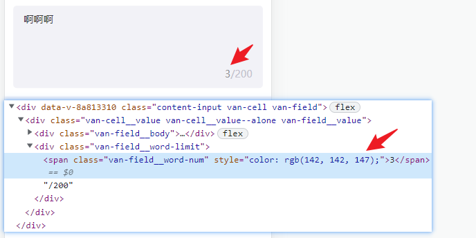

**自定义输入文本域ui**

> 随输入字数定制统计字数颜色



```html
<van-field
    class="content-input"
    v-model="form.content"
    rows="1"
    autosize
    type="textarea"
    label-width="0"
    placeholder="请输入"
    maxlength="200"
    show-word-limit
    :autosize="{ minHeight: 80 }"
/>

<script>
export default {
	methods: {
        setLimitColor(newVal) {
            const len = newVal.length
            const isExit = document.getElementsByClassName('content-input').length
            if (isExit) {
                const inputEl = document.getElementsByClassName('content-input')[0]
                const targetEl = inputEl.getElementsByClassName('van-field__word-num')[0]
                targetEl.style.color = len === 0 ? '#C2C2CC' : len === 200 ? '#ee0a24' : '#8E8E93'
            }
        }
    },
        watch: {
        	'form.content': 'setLimitColor'
    }
}
</script>

<style lang="scss" scoped>
.content-input ::v-deep {
    border-radius: 10px;
    background: #f2f2f7;
    textarea {
        font-family: PingFangSC, PingFang SC;
        font-size: 28px;
        line-height: 42px;
        font-weight: 400;
        color: #3a3a3c;
        &::-webkit-input-placeholder {
            /* WebKit, Blink, Edge */
            color: #999999;
        }
        &:-moz-placeholder {
            /* Mozilla Firefox 4 to 18 */
            color: #999999;
        }
        &::-moz-placeholder {
            /* Mozilla Firefox 19+ */
            color: #999999;
        }
        &:-ms-input-placeholder {
            /* Internet Explorer 10-11 */
            color: #999999;
        }
    }
    .van-field__word-limit {
        font-family: PingFangSC, PingFang SC;
        font-size: 28px;
        line-height: 42px;
        font-weight: 400;
        color: #c2c2cc;
    }
}
</style>
```

