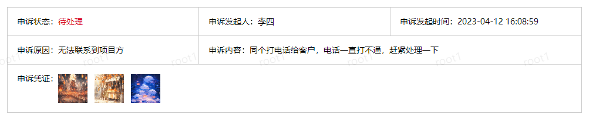
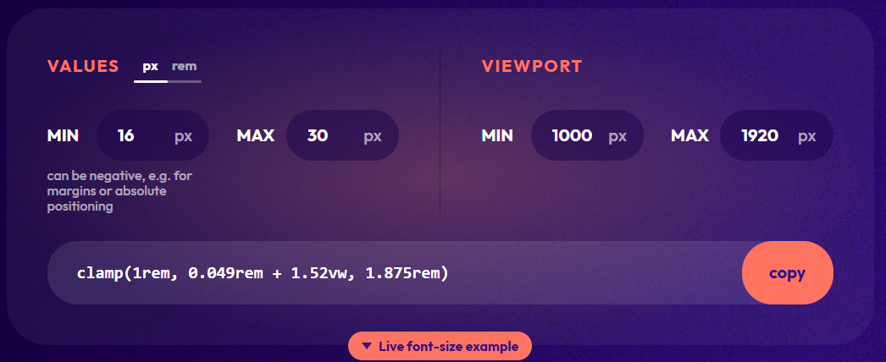
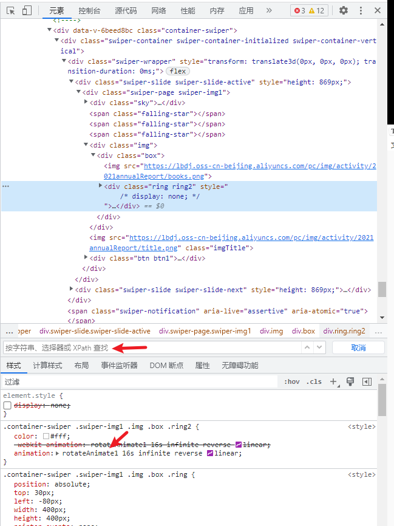

### 覆盖元素背景图

```css
.bg {
    background-image: url('https://xxx.png');
    background-repeat: no-repeat;
    background-size: 100% 100%;
}
```


### 最后一个元素设置特别样式

```less
.item {
    padding: 24px;
    border-bottom: 1px dashed #e5e5ea;
    &:last-child {
        border-bottom: none;
    }
}
```


### css文字渐变

> 链接里也有带阴影文字渐变效果

https://zhuanlan.zhihu.com/p/643134748 那个阴影，用蓝湖样式有问题的，不能直接用 text-shadow

一般把蓝湖的背景色属性值复制到下面 `background-image` 中

```css
.text {
  color: transparent;
  background-image: linear-gradient(45deg, gold, purple, cyan, deeppink);
  -webkit-background-clip: text;
  background-clip: text;
}
```


### 原生不规律表格添加内外border



```react
<!-- 申诉信息 -->
<div class="main-box">
    <div class="box-title">申诉信息</div>
    <div class="appeal-box">
        <div class="appeal-item appeal-8">
            <div class="label">申诉状态</div>
            <div class="value">待处理</div>
        </div>
        <div class="appeal-item appeal-8">
            <div class="label">申诉发起人</div>
            <div class="value">李四</div>
        </div>
        <div class="appeal-item appeal-8">
            <div class="label">申诉发起时间</div>
            <div class="value">xx</div>
        </div>
        <div class="appeal-item appeal-8">
            <div class="label">申诉原因</div>
            <div class="value">无法联系到项目方</div>
        </div>
        <div class="appeal-item appeal-16">
            <div class="label">申诉内容</div>
            <div class="value">xx</div>
        </div>
        <div class="appeal-item appeal-24">
            <div class="label">申诉凭证</div>
            <div class="value">xx</div>
        </div>
    </div>
</div>

<style lang="scss">
.appeal-box {
    display: flex;
    flex-wrap: wrap;
    border-bottom: 1px solid #ccc;
    border-left: 1px solid #ccc;
    .appeal-item {
        display: flex;
        align-items: flex-start;
        padding: 16px;
        border-top: 1px solid #ccc;
        border-right: 1px solid #ccc;
        .label {
            white-space: nowrap;
            &::after {
                content: '：';
                display: inline;
            }
        }
        .value {
            word-break: break-all;
        }
    }
    .appeal-8 {
        width: 33.33%;
    }
    .appeal-16 {
        width: 66.66%;
    }
    .appeal-24 {
        width: 99.99%;
    }
}
</style>
```

- 最后一项自适应占据剩余宽度

```css
.appeal-box {
    .appeal-item:last-child {
    	flex: 1;
    }
}
```


### vue引入并使用字体示例

https://blog.csdn.net/Orange71234/article/details/131323105

https://font.chinaz.com/22110701153.htm


### 文字大小自适应文字宽度

> 场景：图片占满屏幕宽度(高度自适应)，需要添加文字到图片中；对于不同尺寸屏幕，希望字体大小不同。

可以使用 clamp 函数[实现](https://blog.csdn.net/qq_44793507/article/details/129629040)，具体参数可以[调试](https://min-max-calculator.9elements.com/)

如果使用了 sass，注意一些计算单位（如 `vw`）要用 `calc()` [包裹](https://www.likecs.com/ask-6566627.html)


示例：设计稿为1920px，字体30px，需要适配比它小的屏幕，那么按照下面来，然后调另外两个数字就好




### 网页-查看动画代码




### 保留模板中的换行

https://www.python100.com/html/7Z8GF38YV4W3.html
