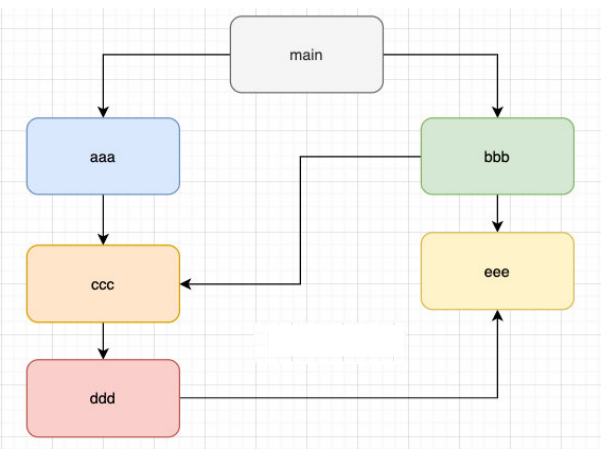

# ES Module

## 导入

导入的值不能重新赋值，类似于使用 `const` 声明过一样。


### 命名导入

导入特定项

```javascript
import { something } from './module.js';
```

导入特定项，并重命名

```javascript
import { something as somethingElse } from './module.js';
```


### 命名空间导入

所有导出的将作为属性和方法暴露在这个对象上；

```javascript
import * as test from './module.js'
```

:turtle: 使用 `test.default` 可以获取默认导出项。


### 默认导入

导入默认导出项

```javascript
import something from './module.js';
```


### 空的导入

加载模块代码，但不创建任何新的变量（可用于 `polyfill` ）

```javascript
import './module.js';
```


### 动态导入

对于需要使用代码分割的应用和使用动态模块会很有用

```javascript
import('./modules.js').then(({ default: DefaultExport, NamedExport })=> {
  // 用模块做一些处理
})
```


## 导出

### 命名导出

导出一个先前声明过的值

```javascript
const something = true;
export { something };
```

在导出时重命名

```javascript
const something = true;
export { something as somethingElse };
```

声明后立即导出

```javascript
// 可以与 var, let, const, class, 和 function 配合使用
export const something = true;
```


### 默认导出

导出单个值作为源模块的默认导出

```javascript
export default something;
```

:hammer_and_wrench: 将默认和命名导出组合在同一模块中是不好的做法，尽管它是规范允许的。


## 导出和导入结合

在开发和封装一个功能库时，通常会将暴露的所有接口放到一个文件中。方便指定统一的接口规范，也方便阅读。

```javascript
export { name, age } from './bar.js'
```

:whale: 通常将  <span style="background: #efe0b9">index.js</span> 作为该出口。


## 运行方式

ES 模块导出的是 <span style="color: #ed5a65">动态绑定</span>，而不是值，因此在最初导入值后，可以对其进行更改，示例：

<span style="background: #efe0b9">incrementer.js</span>

```javascript
export let count = 0;

export function increment() {
  count += 1;
}
```

<span style="background: #efe0b9">main.js</span>

```javascript
import { count, increment } from './incrementer.js';

console.log(count); // 0
increment();
console.log(count); // 1

count += 1; // 错误 — 只有 incrementer.js 才能更改它
```


# commonJS

Node 实现 CommonJS 的本质就是对象的引用赋值。

## export

<span style="background: #efe0b9">bar.js</span>

```javascript
const name = 'demo';
function hey(e) {
  console.log('hey' + e)
}

export.name = name
export.hey = hey
```

:whale: 对于每个 js 文件来说，其内部都会调用 `new Model()` 来生成一个实例 `module`；

:whale: 所以在每个模块都隐式存在 exports 属性，默认值为 `{}`

<span style="background: #efe0b9">main.js</span>

```javascript
// 相当于 bar = exports
const bar = require('./bar');

// 故也可以用结构写法
const { name, age } = require('./bar');
```

:turtle: 引入的其实是 exports 对象的地址，故如果在引入文件中修改它的属性，这可以影响到导出文件中的对象。


## module.exports

内部机制帮助我们做了这么一件事

```javascript
// 在模块的一开始进行赋值
module.exports = export
```

**情况一**

> 没有对 module.exports 进行直接赋值，此时导出值即为 export。

**情况二**

> 进行重新赋值，导出值将会是另一份内存地址（区别于 export 所在的内存地址）

```javascript
module.exports = {}
```

:turtle: 如果 module.exports 不再引用 export 对象了，那么（在导出文件中）修改 export 也就没有意义了。


## require

> require方法，用于引入其它模块中导出的对象。

### 查找路径

<span style="color: #ff0000">情况一</span>

X是一个核心模块，比如path、http。那么直接返回核心模块，并且停止查找。

```javascript
require(X)
```

<span style="color: #ff0000">情况二</span>

X不是一个核心模块，会沿着路径找 <span style="color: #a50">node_modules</span> 文件，找不到会去上级文件找，直至顶层。

```javascript
require(X)
```

:whale: 这些路径可以通过 <span style="color: #a50">module.paths</span> 查看。

<span style="color: #ff0000">情况三</span>

X前带有路径，即以 `./` 或 `../` 或 `/`（根目录）开头。

```less
第一步：将X当做一个文件在对应的目录下查找；
  1.如果有后缀名，按照后缀名的格式查找对应的文件
  2.如果没有后缀名，会按照如下顺序：
    (1). 直接查找文件X
    (2). 查找X.js文件
    (3). 查找X.json文件
    (4). 查找X.node文件
第二步：没有找到对应的文件，将X作为一个目录
  查找目录下面的index文件
    (1). 查找X/index.js文件
    (2). 查找X/index.json文件
    (3). 查找X/index.node文件
如果没有找到，那么报错：not found
```


### 特性

1. 引入即执行

   <span style="background: #efe0b9">bar.js</span>

   ```javascript
   console.log(123)
   ```

   <span style="background: #efe0b9">main.js</span>

   ```javascript
   require(./bar); // 123
   ```

2. 加载过程是同步的

   ```javascript
   require(./bar);
   console.log('afterBar')
   ```

3. 多次被引入，只执行一次

   <span style="background: #efe0b9">main.js</span>

   ```javascript
   require(./bar);
   ```

   <span style="background: #efe0b9">foo.js</span>

   ```javascript
   require(./bar);
   ```

4. 循环引用时，采用深度优先算法遍历图

   ```elm
   main -> aaa -> ccc -> ddd -> eee -> bbb
   ```




## CommonJS的缺点

由于 CommonJS 加载模块是同步的，意味着只有等到对应的模块加载完毕，当前模块中的内容才能被运行。

如果是在服务器中，由于加载的都是本地文件，这不会有什么问题；但浏览器需要先下载再加载运行，会阻塞后面的 js 代码。

我们可以放心地在 webpack 中使用 CommonJS，它会将我们的代码转成浏览器可以直接执行的代码。


## 使用示例

<span style="color: #3a84aa">导出普通对象</span>

```javascript
 // 导出对象
const md = { demo1: 'test' }
module.exports = md

const md = require('./config')
console.log(md.demo1);
```

```javascript
 // 导出对象
module.exports = {
  demo1,
  demo2
}

const { demo1, demo2 } = require('./config')
```

<span style="color: #3a84aa">导出函数</span>

```javascript
 // 导出函数
module.exports = md => {}

const overWriteFenceRule = require('./fence')
```


# 两者的差异

### 解析与运行

```javascript
let condition = true;
if (condition) {
  // 写法一
  import format from './bar.js'
  // 写法二
  require('bar')
  console.log('next')
  // 写法三
  import(./bar.js)
}
```

| --     | 解析                                                         |
| ------ | ------------------------------------------------------------ |
| 写法一 | 会报错：需要在解析阶段分析所有依赖，但这里只有到运行阶段才识别到它 |
| 写法二 | 可行，为函数，同步加载，会阻塞                               |
| 写法三 | 可行，为函数，返回期约                                       |


### 导出值的差异

> 在 ES 中，导出值被记录到 <span style="color: #a50">模块环境记录</span> 中，在导入文件中获取到的都是最新值。
>
> 同样的操作在 CommonJS 中，会输出 1，因为它导出的是个对象，而 1 是个常量值。

```javascript
let a = 1;

setTimeout(() => {
  a = 2
}, 1000)

export { a }
```

```javascript
import { a } from 'bar.js'

setTimeout(() => {
  console.log(a)  // 2
}, 2000)
```


# 两者的交互

通常情况下，CommonJS 不能加载 ES Module

- 因为 CommonJS 是同步加载的，但是 ES Module 必须经过静态分析等，无法在这个时候执行 JavaScript 代码。Node 中不支持。


多数情况下，ES Module 可以加载 CommonJS

-  ES Module 在加载 CommonJS 时，会将其 module.exports 导出的内容作为 default 导出方式来使用；
-  较低版本的 Node 是不支持的。


# 附录

参考资料

- [rollup-模块语法](https://www.rollupjs.com/guide/es-module-syntax)


# 补充的话

在[仓库](https://github.com/SpringLoach/power)，还提供了许多<span style="color: #3a84aa">前端常见需求</span>及实现的归纳整理，欢迎客官看看~

如果这篇笔记能够帮助到你，请帮忙在 [github](https://github.com/SpringLoach/power) 上点亮 `star`，感谢！
