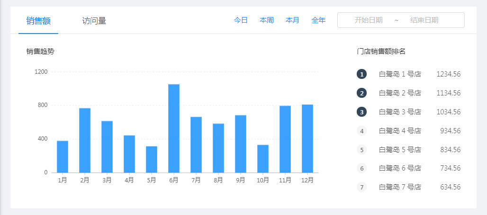
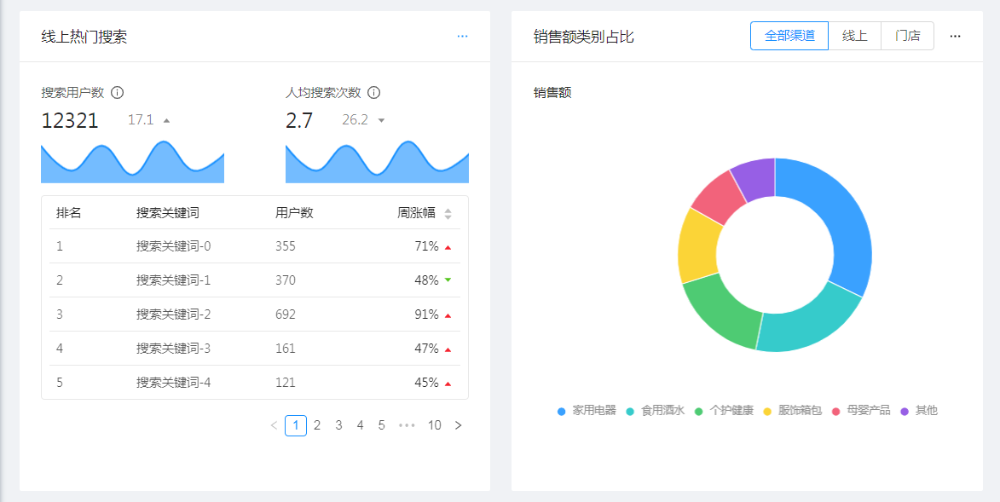
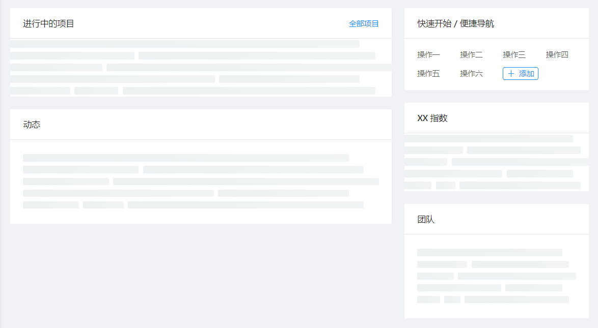
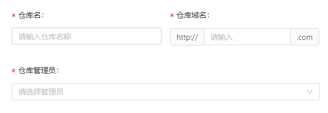

## 表单项相关

### 输入框

#### 带搜索按钮的输入框

> `InputSearch ` 组件自带搜索按钮。


### 单选框

#### 删除点击放大效果

> 该效果由边框阴影产生，找到相应类后复写即可。

```css
.ant-radio-button-wrapper-checked {
  box-shadow: none; 
}
```


### 按钮

#### 删除按钮的闪烁效果

> 往往发生在自定义按钮背景色后。
>
> 产生的原因是组件自带的过渡效果。

```css
demo {
  transition: none;
}
```


## 展开相关

### 树控件

#### 模拟区块背景色

> 树控件不存在同时包含图标和文字区域的（即单一选项）的元素，故想让它实现Menu的激活背景色效果，只能投机取巧。这里用伪元素来模拟背景色。

```less
.ant-tree-treenode-selected {
  position: relative;
}
.ant-tree-treenode-selected::after {
  content: '';
  position: absolute;
  top: 5px;
  right: 0;
  /* 宽高与选项一致 */
  width: 240px;
  height: 44px;
  background: rgba(81, 135, 255, .1);
}
.ant-tree-treenode-selected::before {
  content: '';
  position: absolute;
  top: 5px;
  right: 0;
  width: 3px;
  height: 44px;
  background:rgba(81,135,255,1);
}
```


## 布局相关

### layout布局

响应式布局


```html
<a-row :gutter="24">
  <a-col :sm="24" :md="12" :xl="6" :style="{ marginBottom: '24px' }"></a-col>
  <a-col :sm="24" :md="12" :xl="6" :style="{ marginBottom: '24px' }"></a-col>
  <a-col :sm="24" :md="12" :xl="6" :style="{ marginBottom: '24px' }"></a-col>
  <a-col :sm="24" :md="12" :xl="6" :style="{ marginBottom: '24px' }"></a-col>
</a-row>
```




```html
<a-card :loading="loading" :bordered="false" :body-style="{padding: '0'}">
  <div class="salesCard">
    <a-tabs default-active-key="1" size="large" :tab-bar-style="{marginBottom: '24px', paddingLeft: '16px'}">
      <div class="extra-wrapper" slot="tabBarExtraContent">右侧内容</div>
      <a-tab-pane loading="true" tab="销售额" key="1"></a-tab-pane>
      <a-tab-pane tab="访问量" key="2"></a-tab-pane>
    </a-tabs>
  </div>
</a-card>
```

卡片组件的 loading 属性可以添加骨架加载的效果。





```html
<div class="antd-pro-pages-dashboard-analysis-twoColLayout" :class="!isMobile && 'desktop'">
  <a-row :gutter="24" type="flex">
    <a-col :xl="12" :lg="24" :style="{ marginTop: '24px' }"></a-col>
    <a-col :xl="12" :lg="24" :style="{ marginTop: '24px' }"></a-col>
  </a-row>
</div>
```




```html
<a-row :gutter="24">
  <a-col :xl="16" :lg="24" :md="24" :sm="24" :xs="24">
    <a-card :loading="loading" title="进行中的项目" :bordered="false" style="margin-bottom: 24px;"></a-card>
    <a-card :loading="loading" title="动态" :bordered="false"></a-card>
  </a-col>
  
  <a-col :xl="8" :lg="24" :md="24" :sm="24" :xs="24">
    <a-card title="快速开始 / 便捷导航" :bordered="false" style="margin-bottom: 24px;"></a-card>
    <a-card title="XX 指数" :bordered="false" style="margin-bottom: 24px;" :loading="radarLoading"></a-card>
    <a-card title="团队" :bordered="false":loading="loading"></a-card>
  </a-col>
</a-row>
```




```html
<a-row :gutter="16">
  <a-col :lg="6" :md="12" :sm="24"></a-col>
  <a-col :xl="{span: 7, offset: 1}" :lg="8" :md="12" :sm="24"></a-col>
  <a-col :xl="{span: 9, offset: 1}" :lg="10" :md="24" :sm="24"></a-col>
</a-row>
```


```html
<template v-for="(col, i) in ['name', 'workId', 'department']" :slot="col" slot-scope="text, record">
  <a-input
    :key="col"
    v-if="record.editable"
    style="margin: -5px 0"
    :value="text"
    :placeholder="columns[i].title"
    @change="e => handleChange(e.target.value, record.key, col)"
  />
  <template v-else>{{ text }}</template>
</template>
```
```javascript
data: [
  {
    key: '1',
    name: '小明',
    workId: '001',
    editable: false,
    department: '行政部'
  }
]

handleChange (value, key, column) {
  const newData = [...this.data]
  const target = newData.find(item => key === item.key)
  if (target) {
    target[column] = value
    this.data = newData
  }
}
```

通过 key 找到对应的数据项


