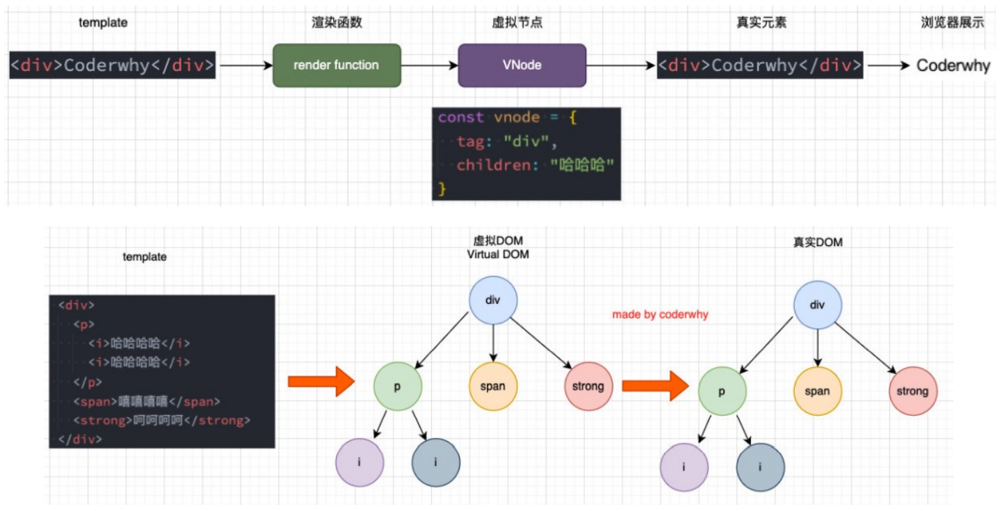
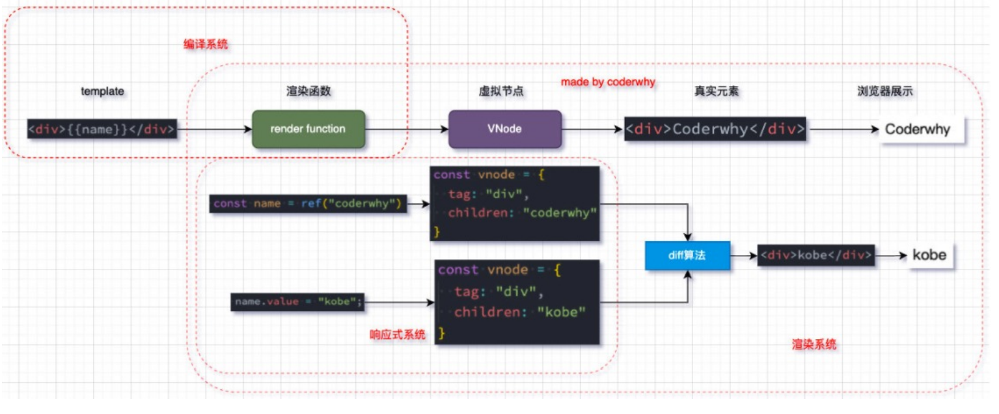

## 虚拟DOM的渲染过程




## Vue的三大核心系统

Compiler模块：编译模板系统； 

Runtime模块：也可以称之为Renderer模块，真正渲染的模块； 

Reactivity模块：响应式系统




## 实现Mini-Vue

渲染系统模块； 

可响应式系统模块； 

应用程序入口模块；


### 渲染系统

<span style="backGround: #efe0b9">index.html</span>

作为入口文件，使用自定义的方法模拟Vue。

```html
<div id="app"></div>

<script src="./renderer.js"></script>
<script>

  // 1.通过h函数来创建一个vnode
  const vnode = h('div', {class: "why", id: "aaa"}, [
    h("h2", null, "当前计数: 100"),
    h("button", {onClick: function() {}}, "+1")
  ]);

  // 2.通过mount函数, 将vnode挂载到div#app上
  mount(vnode, document.querySelector("#app"))

</script>
```

<span style="backGround: #efe0b9">renderer.js</span>

```javascript
const h = (tag, props, children) => {
  // vnode -> javascript对象 -> {}
  return {
    tag,
    props,
    children
  }
}

const mount = (vnode, container) => {
  // vnode -> element
  // 1.创建出真实的原生, 并且在vnode上保留el
  const el = vnode.el = document.createElement(vnode.tag);

  // 2.处理props
  if (vnode.props) {
    for (const key in vnode.props) {
      const value = vnode.props[key];

      // 对事件和普通属性做不同处理
      if (key.startsWith("on")) { 
        el.addEventListener(key.slice(2).toLowerCase(), value)
      } else {
        el.setAttribute(key, value);
      }
    }
  }

  // 3.处理children
  if (vnode.children) {
    // 对字符串/数组作不同处理
    if (typeof vnode.children === "string") {
      el.textContent = vnode.children;
    } else {
      vnode.children.forEach(item => {
        mount(item, el);
      })
    }
  }

  // 4.将el挂载到container上
  container.appendChild(el);
}
```

由于 mount 会递归调用，能够实现每个节点上都存在对应的标签（el）。


#### h函数的实现

直接返回一个VNode对象即可


#### mount函数的实现

 第一步：根据 tag，创建HTML元素，并且存储到 vnode 的 el 属性中； 

 第二步：处理props属性 

- 如果以on开头，那么监听事件； 

- 普通属性直接通过 setAttribute 添加即可； 

 第三步：处理子节点 

- 如果是字符串节点，那么直接设置 textContent；

- 如果是数组节点，那么遍历调用 mount 函数；


#### patch函数的实现

<span style="backGround: #efe0b9">index.html</span>

```javascript
// 1. 创建新旧vnode
const vnode = h('div', {class: "why", id: "aaa"}, [
  h("h2", null, "当前计数: 100"),
  h("button", {onClick: function() {}}, "+1")
]); // vdom

const vnode1 = h('div', {class: "coderwhy", id: "aaa"}, [
    h("h2", null, "呵呵呵"),
    h("button", {onClick: function() {}}, "-1")
  ]); 

// 2.挂载旧的vnode
mount(vnode, document.querySelector("#app"))

// 3.使用新的vnode进行更新
setTimeout(() => {
  patch(vnode, vnode1);
}, 2000)
```


<span style="backGround: #efe0b9">renderer.js</span>

```javascript
const patch = (n1, n2) => {
  /* 如果两个节点的标签类型都不一致，直接重新挂载 */
  if (n1.tag !== n2.tag) {
    const n1ElParent = n1.el.parentElement;
    n1ElParent.removeChild(n1.el);
    mount(n2, n1ElParent);
  /* 否则 */
  } else {
    // 1.取出element对象, 并且在n2中进行保存
    const el = n2.el = n1.el;

    // 2.处理props
    const oldProps = n1.props || {};
    const newProps = n2.props || {};
    // 2.1.获取所有的newProps添加/更新到el
    for (const key in newProps) {
      const oldValue = oldProps[key];
      const newValue = newProps[key];
      if (newValue !== oldValue) {
        if (key.startsWith("on")) { // 对事件监听的判断
          el.addEventListener(key.slice(2).toLowerCase(), newValue)
        } else {
          el.setAttribute(key, newValue);
        }
      }
    }

    // 2.2.从el删除旧的props
    for (const key in oldProps) {
      if (key.startsWith("on")) { // 对事件监听的判断(①)
        const value = oldProps[key];
        el.removeEventListener(key.slice(2).toLowerCase(), value)
      } 
      if (!(key in newProps)) {
        el.removeAttribute(key);
      }
    }

    // 3.处理children
    const oldChildren = n1.children || [];
    const newChidlren = n2.children || [];

    if (typeof newChidlren === "string") { // 情况一: newChildren本身是一个string
      // 边界情况
      if (typeof oldChildren === "string") {
        if (newChidlren !== oldChildren) {
          el.textContent = newChidlren
        }
      } else {
        el.innerHTML = newChidlren;
      }
    } else { // 情况二: newChildren本身是一个数组
      if (typeof oldChildren === "string") {
        el.innerHTML = "";
        newChidlren.forEach(item => {
          mount(item, el);
        })
      } else {
        // oldChildren: [v1, v2, v3, v8, v9]
        // newChildren: [v1, v5, v6]
        // 1.前面有相同节点的原生进行patch操作(②)
        const commonLength = Math.min(oldChildren.length, newChidlren.length);
        for (let i = 0; i < commonLength; i++) {
          patch(oldChildren[i], newChidlren[i]);
        }

        // 2.newChildren.length > oldChildren.length
        if (newChidlren.length > oldChildren.length) {
          newChidlren.slice(oldChildren.length).forEach(item => {
            mount(item, el);
          })
        }

        // 3.newChildren.length < oldChildren.length
        if (newChidlren.length < oldChildren.length) {
          oldChildren.slice(newChidlren.length).forEach(item => {
            el.removeChild(item.el); // 旧节点经过mount处理，故子节点也存在el
          })
        }
      }
    }
  }
}
```

:turtle: 对于①，由于缺陷而做了一个妥协：添加事件时，会创建不同的函数对象；为了避免重复添加事件监听，将所有旧的监听移除。

:turtle: 对于②，vue 内部进行了更优的算法，这里大致了解思路就好。


### 响应式系统

#### dep实现

Dep 类本身维护一个集合（与数组比较，可以防重）。

```javascript
class Dep {
  constructor() {
    this.subscribers = new Set();
  }

  // 添加副作用（方法）
  addEffect(effect) {
    this.subscribers.add(effect);
  }

  // 执行所有的副作用（方法）
  notify() {
    this.subscribers.forEach(effect => {
      effect();
    })
  }
}

const info = {counter: 100};

const dep = new Dep();

function doubleCounter() {
  console.log(info.counter * 2);
}

function powerCounter() {
  console.log(info.counter * info.counter);
}

dep.addEffect(doubleCounter);
dep.addEffect(powerCounter);

info.counter++;
dep.notify();
```


#### defineProperty版

使用 WeakMap 的好处是：本身不会存在对对象的引用，即当对象的所有引用被销毁后，方便垃圾回收。

```javascript
class Dep {
  constructor() {
    this.subscribers = new Set();
  }

  depend() {
    if (activeEffect) {
      this.subscribers.add(activeEffect);
    }
  }

  notify() {
    this.subscribers.forEach(effect => {
      effect();
    })
  }
}

/* 辅助副作用（方法）的收集，在执行副作用时，会被 Object.defineProperty 的 get 方法劫持 */
let activeEffect = null;
function watchEffect(effect) {
  activeEffect = effect;
  effect();
  activeEffect = null;
}


/* 储存不同映射的数据结构（映射的键为对象属性，值为该对象属性对应的Dep） */
const targetMap = new WeakMap();
function getDep(target, key) {
  // 1.获取对应目标对象(target)的Map 
  let depsMap = targetMap.get(target);
  if (!depsMap) {
    depsMap = new Map();
    targetMap.set(target, depsMap);
  }

  // 2.获取对应目标对象属性的Dep，并返回
  let dep = depsMap.get(key);
  if (!dep) {
    dep = new Dep();
    depsMap.set(key, dep);
  }
  return dep;
}


/* 为 Vue2 的实现，劫持需要添加到响应式的对象（raw） */
function reactive(raw) {
  Object.keys(raw).forEach(key => {
    const dep = getDep(raw, key);
    let value = raw[key];

    Object.defineProperty(raw, key, {
      // 收集依赖，并返回新值
      get() {
        dep.depend();
        return value;        // 这里的新值用 value 返回
      },
      // 更新值，并触发所有副作用
      set(newValue) {
        if (value !== newValue) {
          value = newValue;  // 这里赋值给 value，而不能赋值给 raw[key]，否则会造成循环调用
          dep.notify();
        }
      }
    })
  })

  return raw;
}


/* 测试代码 */
const info = reactive({counter: 100, name: "why"});
const foo = reactive({height: 1.88});

// watchEffect1
watchEffect(function () {
  console.log("effect1:", info.counter * 2, info.name);
})

// watchEffect2
watchEffect(function () {
  console.log("effect2:", info.counter * info.counter);
})

// watchEffect3
watchEffect(function () {
  console.log("effect3:", info.counter + 10, info.name);
})

watchEffect(function () {
  console.log("effect4:", foo.height);
})

// info.counter++;
// info.name = "why";
foo.height = 2;
```


**结构示意**

```javascript
obj: {
  att1: 1,
  att2: 2
}

/* map: 键为 obj */
obj: {
  attr1: attr1Dep
  attr2: attr2Dep
}
```


#### proxy版

<span style="backGround: #efe0b9">reactive.js</span>

```javascript
class Dep {
  constructor() {
    this.subscribers = new Set();
  }

  depend() {
    if (activeEffect) {
      this.subscribers.add(activeEffect);
    }
  }

  notify() {
    this.subscribers.forEach(effect => {
      effect();
    })
  }
}

/* 辅助副作用（方法）的收集，在执行副作用时，会被 Object.defineProperty 的 get 方法劫持 */
let activeEffect = null;
function watchEffect(effect) {
  activeEffect = effect;
  effect();
  activeEffect = null;
}

/* 储存不同映射的数据结构（映射的键为对象属性，值为该对象属性对应的Dep） */
const targetMap = new WeakMap();
function getDep(target, key) {
  // 1.获取对应目标对象(target)的Map 
  let depsMap = targetMap.get(target);
  if (!depsMap) {
    depsMap = new Map();
    targetMap.set(target, depsMap);
  }

  // 2.获取对应目标对象属性的Dep，并返回
  let dep = depsMap.get(key);
  if (!dep) {
    dep = new Dep();
    depsMap.set(key, dep);
  }
  return dep;
}


/* 为 Vue3 的实现，劫持需要添加到响应式的对象（raw） */
function reactive(raw) {
  return new Proxy(raw, {
    get(target, key) {
      const dep = getDep(target, key);
      dep.depend();
      return target[key];
    },
    set(target, key, newValue) {
      const dep = getDep(target, key);
      target[key] = newValue;          // 监听的是proxy对象的属性改变，不会造成循环调用
      dep.notify();
    }
  })
}
```


#### 两种实现对比

- 劫持对象的不同 

  - Object.definedProperty 需要循环<span style="color: #ff0000">对象的属性</span>，分别进行劫持，故新增元素时要特殊处理

  - 即需要再次循环对象调用 definedProperty，而 Proxy 劫持的是<span style="color: #ff0000">整个对象</span>； 

- 修改对象、触发拦截时机的不同 
  - 使用 defineProperty 时，我们修改<span style="color: #ff0000">原来的对象</span>就可以触发拦截；
  - 而使用 proxy，就必须<span style="color: #ff0000">修改代理对象</span>，即 Proxy 的实例<span style="color: #ff0000">才可以触发拦截</span>；
  
- Proxy 能观察的类型比 defineProperty 更丰富
  - has：in操作符的捕获器（循环对象）；
  - deleteProperty：delete 操作符的捕捉器等
  
- Proxy 作为新标准将受到浏览器厂商重点持续的性能优化； 

- 缺点：Proxy 不兼容IE，也没有 polyfill, defineProperty 能支持到 IE9


### Mini-Vue

<span style="backGround: #efe0b9">index.html</span>

```html
<body>
  
  <div id="app"></div>
  <script src="./renderer.js"></script>
  <script src="./reactive.js"></script>
  <script src="./index.js"></script>

  <script>
    // 1.创建根组件
    const App = {
      data: reactive({
        counter: 0
      }),
      render() {
        return h("div", null, [
          h("h2", null, `当前计数: ${this.data.counter}`),
          h("button", {
            onClick: () => {
              this.data.counter++
              console.log(this.data.counter);
            }
          }, "+1")
        ])
      }
    }

    // 2.挂载根组件
    const app = createApp(App);
    app.mount("#app");
  </script>

</body>
```

<span style="backGround: #efe0b9">index.js</span>

- createApp用于创建一个app对象

- 该app对象有一个mount方法，可以将根组件挂载到某一个dom元素上。

```javascript
function createApp(rootComponent) {
  return {
    mount(selector) {
      const container = document.querySelector(selector);
      let isMounted = false;
      let oldVNode = null;

      // 同时实现挂载和更新功能
      watchEffect(function() {
        if (!isMounted) {
          oldVNode = rootComponent.render();
          mount(oldVNode, container);
          isMounted = true;
        } else {
          const newVNode = rootComponent.render();
          patch(oldVNode, newVNode);
          oldVNode = newVNode;
        }
      })
    }
  }
}
```

